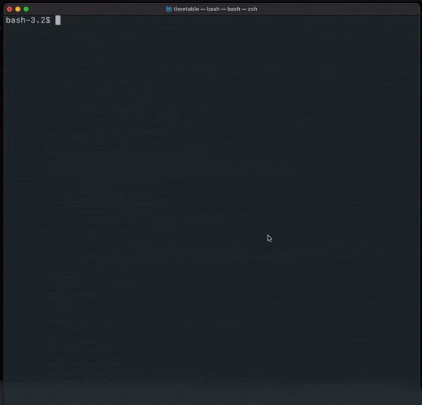

timetable-ics-tdtu
==================

https://github.com/iconclub/timetable-ics-tdtu

Mô tả
-----

Đây là chương trình xuất thời khoá biểu của sinh viên theo học kì ra [file ics](https://en.wikipedia.org/wiki/ICalendar). Chương trình được viết trên ngôn ngữ lập trình Python.

Hướng dẫn
---------
1. Tải thư viện được sử dụng trong chương trình.

`
pip install -r requirements.txt
`

2. Chạy file main.py.

`
python main.py
`

3. Lần lượt nhập mssv và password, rồi chọn học kỳ.

Lưu ý
-----

Chương trình này viết nhằm mục đích hỗ trợ xuất ra file ics để sinh viên có thể tích hợp vào Google Calendar hoặc Windows Calendar.

Mã nguồn của chương trình hoàn toàn được công khai và không thực hiện bất cứ hành vi lưu thông tin mssv hay password của sinh viên.

Sinh viên không được sử dụng mã nguồn này để thực hiện những công việc vi phạm quy định của nhà trường, tác giả không chịu trách nhiệm cho những hành động của các bạn.
